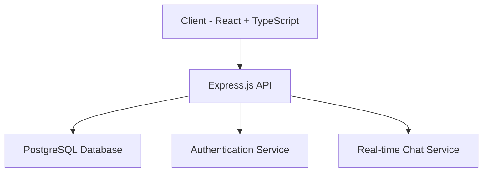

# Women's Support Network 👩‍👩‍👧‍👦

A supportive social platform designed to empower women through digital connections and community-driven interactions.


[](https://replit.com/github/yourusername/your-repo)

## ✨ Live Demo
Try out the application: [Live Demo](https://your-app.replit.app)

## 🌟 Features

- **Community Groups** - Join interest-based groups for meaningful discussions
- **Real-time Chat** - Connect instantly with group members
- **Rich Profiles** - Customize your profile with images, bio, and interests
- **Interactive Posts** - Share text, images, and videos with your community
- **Mobile-First Design** - Fully responsive for all devices
- **Secure Authentication** - Protected user data and privacy

## 🚀 Tech Stack

- **Frontend**: React.js + TypeScript
- **Backend**: Express.js
- **Database**: PostgreSQL
- **State Management**: TanStack Query
- **UI Components**: shadcn/ui + Tailwind CSS
- **Authentication**: Passport.js

## 💻 Quick Start

### Prerequisites

- Node.js (v18 or higher)
- PostgreSQL database

### One-Click Deploy
[](https://replit.com/github/yourusername/your-repo)

### Local Development

1. Clone the repository:
```bash
git clone https://github.com/yourusername/your-repo.git
cd your-repo
```

2. Install dependencies:
```bash
npm install
```

3. Set up environment variables:
Create a `.env` file with:
```env
DATABASE_URL=your_postgresql_url
SESSION_SECRET=your_session_secret
```

4. Start the development server:
```bash
npm run dev
```

## 🌐 Deployment Options

### 1. Replit (Recommended)
- Fork the repository to Replit
- Set up environment variables in Replit's Secrets tab
- Click "Run" to deploy

### 2. Alternative Hosting Platforms
Since this is a full-stack application with a database, we recommend:

- **[Railway](https://railway.app)** - Offers PostgreSQL + Node.js hosting
- **[Render](https://render.com)** - Free tier available with PostgreSQL support
- **[Heroku](https://heroku.com)** - Traditional reliable platform

### 3. Manual Deployment
For production deployment:
```bash
npm run build
npm start
```

## 🌈 Key Features

### Groups and Communities
- Create and join interest-based groups
- Real-time group chat
- Share posts within groups
- Organize events and discussions

### Profile Customization
- Upload profile and cover images
- Customize profile themes
- Share your interests and bio
- Connect social media accounts

### Interactive Posts
- Support for text, images, and videos
- Like and react to posts
- Comment on posts
- Share posts with the community

## 🛠️ Architecture



## 🤝 Contributing

1. Fork the repository
2. Create your feature branch (`git checkout -b feature/AmazingFeature`)
3. Commit your changes (`git commit -m 'Add some AmazingFeature'`)
4. Push to the branch (`git push origin feature/AmazingFeature`)
5. Open a Pull Request

## 📝 License

This project is licensed under the MIT License - see the [LICENSE](LICENSE) file for details.

## 🌟 Support

If you encounter any issues or have questions:
1. Open an issue in this repository
2. Join our [Discord community](https://discord.gg/your-server)
3. Contact support at support@your-domain.com

## 🔮 Future Enhancements

- [ ] Enhanced notification system
- [ ] Group event management
- [ ] Advanced search functionality
- [ ] Direct messaging between users
- [ ] Content moderation tools
- [ ] Integration with external women's support services

---

Built with ❤️ for women supporting women